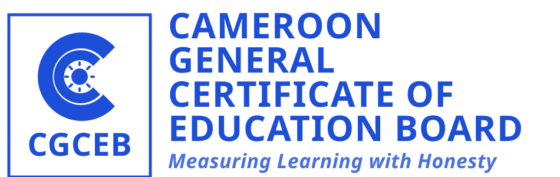

# GCE Answers Showcase

  
   
  <strong>A window into the future of academic collaboration in Cameroon.</strong>
   
  <a href="https://gceanswers.com/">🌐 Live Platform: gceanswers.com</a>

> [!IMPORTANT]
> **Disclaimer**: This is a community-driven project and is **not** an official platform of the Cameroon General Certificate of Education (GCE) Board.

  
   
  

---

## 📑 Table of Contents
- [Showcase Overview](#-showcase-overview)
- [Mission & Vision](#-mission--vision)
- [Key Platform Features](#-key-platform-features)
- [Development Roadmap](#-development-roadmap)
- [The Modern Tech Stack](#-the-modern-tech-stack)
- [Documentation & Branding](#-documentation--branding)
- [License & Disclaimer](#-license--disclaimer)

---

## 🔍 Showcase Overview
This repository serves as the public landing page and documentation hub for **GCE Answers**. It highlights our vision, technical direction, and the progress of our platform while keeping the core application source code private.

---

## 🎯 Mission & Vision
Our mission is to provide every student in Cameroon with a high-quality, social, and accessible way to prepare for their exams. We are building a space where academic help is only a question away.

---

## 💡 Key Platform Features
- **Academic Q&A**: Native support for math/science formulas (KaTeX).
- **Gamification**: 80+ unique badges and a reputation system.
- **Verified Expertise**: Trust indicators for real-world educators.
- **Real-time Hub**: Peer-to-peer messaging and instant notifications.

---

## 🗺️ Development Roadmap

Here is a look at what we've achieved and where we are heading next:

### ✅ Completed
- [x] **Next.js 16 & React 19**: Successfully moved to the latest web infrastructure.
- [x] **Core Q&A Engine**: Threading, voting, and accepted answers are fully live.
- [x] **Monorepo Architecture**: Efficient, type-safe development environment.
- [x] **Unified Branding**: Established the GCE Answers and CGCEB dual branding.

### 🚧 Future Milestones
- [ ] **Badge Automation**: Transitioning the gamification logic to the backend.
- [ ] **Syllabus Tracker**: Implementation of mastery dashboards for students.
- [ ] **Search v2**: Global full-text search and advanced discovery.

---

## 🏗️ The Modern Tech Stack
The private platform leverages the latest in web technology:
- **Framework**: Next.js 16 & React 19
- **Styling**: Tailwind CSS 4
- **Database**: Kysely + PostgreSQL
- **Real-time**: Upstash Redis

---

## 📜 Documentation & Branding
- `README.md`: High-level overview and mission.
- `logo.svg`: Official GCE Answers community branding.
- `camgceb.svg`: Secondary branding for the Cameroon GCE Board.

---

## ⚖️ License & Disclaimer
This documentation and branding are proprietary to **GCE Answers**. 

---

Made with ❤️ for the future of education in Cameroon.

